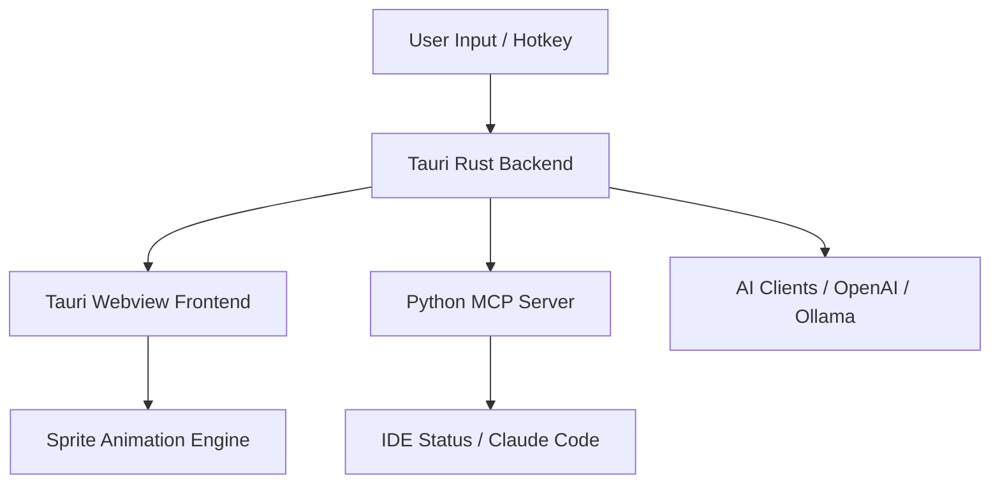

# Design Spec: Windows Porting (Desktoppet-RS)

## Overview
将 DesktoppetSwift 移植到 Windows 平台，并探索最佳的跨平台技术方案，以支持 Windows 的透明窗口、置顶显示、系统托盘和全局快捷键。

## Decisions

### 1. 技术栈：Tauri (v2) + React + Rust

**决策**：使用 Tauri 作为跨平台底座，Rust 负责系统集成，React + CSS 负责前端展示。

**理由**：
- ✅ **资源效率**：相比 Electron，Tauri 的内存和包体积显著更小（符合“小桌宠”定位）。
- ✅ **透明窗口支持**：Windows 的透明、无边框、鼠标穿透在 Tauri 中有成熟的支持。
- ✅ **系统级 API**：Rust 后端可以轻松调用 Windows 的 `RegisterHotKey`、托盘菜单等原生功能。
- ✅ **MCP 兼容性**：后端 Rust 可以无缝调用现有的 Python MCP 服务器。

### 2. 窗口管理：透明 + 鼠标穿透 (Passthrough)

**决策**：
- 桌宠主窗口保持透明，不可调整大小。
- 在宠物所在的矩形区域内响应点击，透明背景区域支持鼠标穿透（Passthrough）。

**实现方式 (Tauri)**:
- 设置 `window.set_shadow(false)`。
- 在 Rust 层使用自定义窗口效果（或 Win32 API `SetWindowLong` 设置 `WS_EX_LAYERED` 和 `WS_EX_TRANSPARENT`）。

### 3. 精灵图动画：共享资源与逻辑

**决策**：直接复用现有的像素精灵图资源，前端使用 `Canvas` 或 `` 结合 `requestAnimationFrame` 驱动。

**理由**：
- 资源 100% 共享，无需重新制作动画。
- 逻辑可以在 JS/TS 中重写，并保持与 Swift 版本的一致性。

### 4. 架构架构

## Migration Plan

### 阶段 1: 基础骨架 (MVP on Windows)
- 初始化 Tauri 项目。
- 实现透明窗口和基础置顶逻辑。
- 在 Windows 托盘显示图标。

### 阶段 2: 动画与交互
- 移植精灵图加载逻辑到前端。
- 实现基础状态机（idle, walk, jump）。
- 实现鼠标悬停和点击交互。

### 阶段 3: AI 与 MCP 集成
- 移植 AI 客户端逻辑（或在 Rust 中重写）。
- 集成现有的 Python MCP 服务器，支持与 IDE 互动。
- 实现 Windows 版本的全局快捷键。

## Risks / Trade-offs

- **屏幕采集 (Screenshot Analysis)**: Windows 的屏幕采集权限和 API 与 macOS (ScreenCaptureKit) 完全不同，需要使用 `crabs` 或其他 Windows 截图库。
- **WebView 兼容性**: Windows 上使用 WebView2 (Edge)，需要确保用户系统已安装（Win10/11 默认自带）。
- **性能**: 虽然 Tauri 轻量，但双进程通讯可能引入微小延迟。
